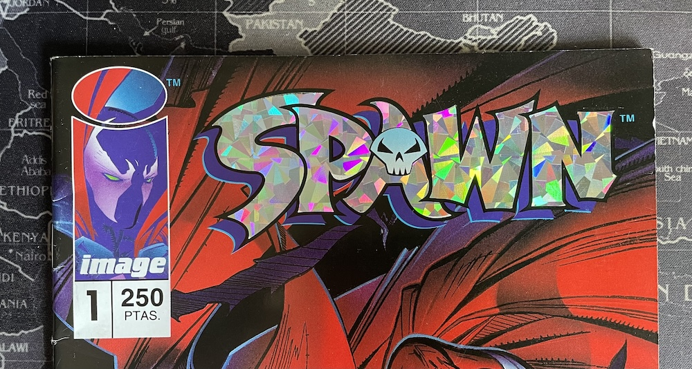
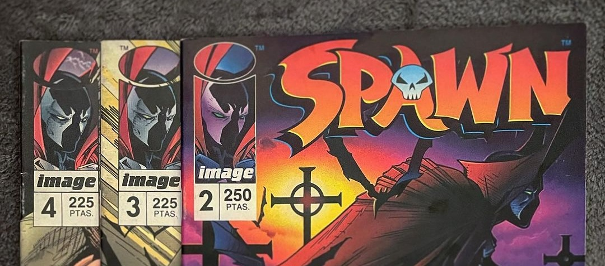
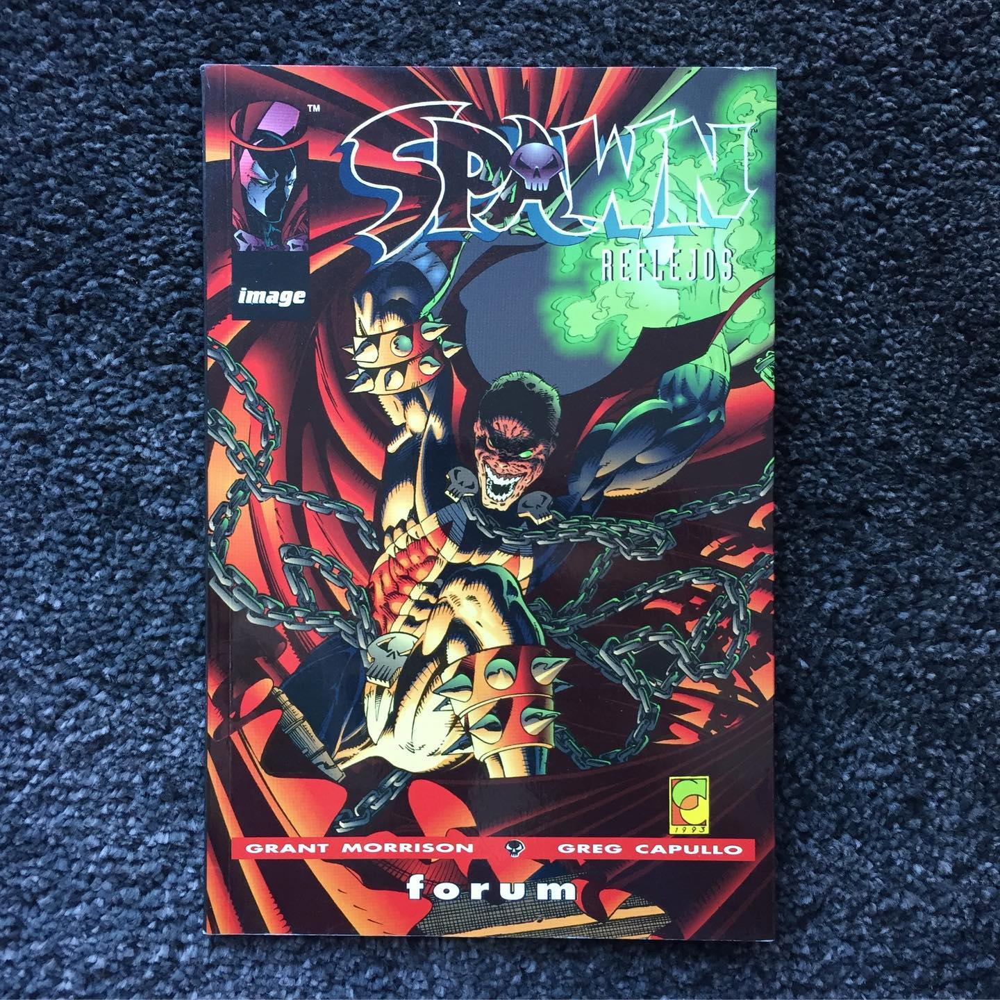
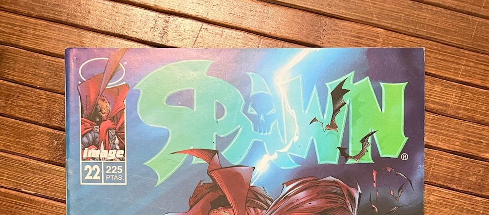

Empezamos relectura de Spawn. ¿Estamos locos? Estamos locos.

No sé hasta dónde podré llegar, porque el primer volumen no lo tengo completo en grapa (al menos los 50 o 60 primeros números recuerdo tenerlos, a partir de ahí quizá habría que completar colección).

¿Soy sincero? Echo la vista atrás y no entiendo por qué fuimos tan duros con los (algunos) tebeos de Image. Si alguien puede plantarse y venderme la moto de que lo que se hace hoy en día en mainstream americano es (de media) mejor que esto, no lo veo. En esta colina moriré. Dejo a la elección de cada uno pensar si lo que estoy haciendo es alabar la calidad de los cómics originales de Image o criticar la calidad media del cómic americano de las últimas décadas.

Vamos a crear un *timeline* en el que ir escribiendo acerca de cada lectura que voy haciendo, con enlaces a cada uno de los *posts* individuales. No sé si me dará para mucho, pero lo intentaré.

## Volumen 1, las primeras cien grapas





El número 1 de **Spawn** es un hito significativo en la industria del cómic. Publicado en Mayo/Junio de 1992 por Image Comics (la fecha baila según la fuente, pero la propia Image [lo fecha en Junio](https://imagecomics.com/comics/releases/spawn-1)), vendiendo originalmente 1.7 millones de ejemplares. Creación de [Todd McFarlane](https://en.wikipedia.org/wiki/Todd_McFarlane), que también escribe y dibuja este primer número. Reconocido por su trabajo en The Amazing Spider-Man, McFarlane decidió fundar Image Comics junto con otros artistas destacados para tener más control creativo sobre su trabajo, siendo Spawn uno de los títulos inaugurales de la editorial.

El primer número nos presenta a **Al Simmons**, un ex-soldado y agente de la CIA que es traicionado y asesinado. Simmons hace un pacto con alguna malvada entidad para volver a la vida y ver a su esposa de nuevo, pero regresa como el antihéroe conocido como Spawn, desfigurado y con fragmentos de su memoria perdida y extraños poderes que aún no comprende, habiendo pasado ya cinco años desde su muerte.

Como detalles interesantes, aparecen ya **Sam y Twitch**, dos policías que comienzan a investigar lo que va sucediendo en el cómic y que acabarán teniendo colección propia en 1999, y podemos ver los continuos interludios en forma de pantallas de televisión con tres presentadores distintos, recurso *fusiladísimo* de los famosos Batman de Frank Miller, pero que están bien llevados y nos ayudan a entender el mundo de Spawn con una buena alternativa a simples textos de apoyo expositivos.

[Post original](/2024/05/30/empezamos-relectura-de-spawn-estamos-locos-estamos-locos/).





Con los números 2, 3 y 4 terminaría la puesta en situación del personaje. Todd McFarlane nos presenta una guerra entre el cielo y el infierno, en la que Spawn ha sido reclutado por parte de estos últimos, y le han metido en una situación de la que va a tener difícil escapatoria.

Ha vuelto a la vida con una serie de poderes que, cuando se agoten, producirán una segunda muerte y la definitiva pérdida de su alma. Y aquí empezamos a jugar.

[Post original](/2024/08/01/relectura-de-spawn-termina-la-presentacion/).





{.left width=50%}

La única vez que Spawn se ha publicado con el sello de cómics forum, o al menos eso creo recordar, ya que siempre se editó bajo el sello World Comics.

Al llegar al número 16 de la serie regular, aprovechando una mínima etapa donde entró **Grant Morrison** a los guiones, un novato **Greg Capullo** empezaba con Spawn sustituyendo a McFarlane por primera vez desde el inicio de la serie.

Las tres grapas que incluye nunca se han publicado de forma independiente en castellano, siempre en formato tomo, para mi desgracia como coleccionista.

[Post original](/2019/06/08/para-el-viernesvintage-la-unica-vez-que-spawn-se-ha-publicado-con-el-sello-de-comics-forum/).





No había pasado mucho desde la fundación de Image, y tras crossovers, artistas invitados, portadas múltiples, y todos los trucos ya utilizados por las *majors*, a los creadores de Image se les ocurrió intercambiar juguetes. En el *Image X Month* **Marc Silvestri** dibujó Spawn, Jim Lee se ocupó de Savage Dragon, Erik Larsen de los WildC.A.T.S., Jim Valentino estuvo en Youngblood, Rob Liefeld en Shadowhawk y Todd McFarlane puso los lápices a Cyber Force.

[Post original](/2023/12/23/el-22-de-diciembre-el-numero-22-de-spawn-que-correspondia-con-el-mes-x-de-image/).





Y, a partir de aquí, todos los *posts* etiquetados como **Spawn** que se han publicado en la web.
